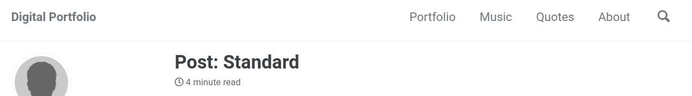

# Webiste Creation Notes
## Setup
1. First, follow [github's instructions to create your own website](https://pages.github.com/).

2. Next, [install Jekyll on Ubuntu](https://jekyllrb.com/docs/installation/ubuntu/) with the following commands:
    ```
    sudo apt-get install ruby-full build-essential zlib1g-dev
    echo '# Install Ruby Gems to ~/gems' >> ~/.bashrc
    echo 'export GEM_HOME="$HOME/gems"' >> ~/.bashrc
    echo 'export PATH="$HOME/gems/bin:$PATH"' >> ~/.bashrc
    source ~/.bashrc
    gem install jekyll bundler
    ```
## Jekyll Setup
Follow the [Jekyll Quickstart](https://jekyllrb.com/docs/)

1. Create a new Jekyll site at ./myblog.
    ```
    cd <path-to-repo>
    jekyll new myblog
    ```
2. Build the site and make it available on a local server.
    ```
    cd myblog
    bundle exec jekyll serve
    ```

3. Browse to http://localhost:4000

## Jekyll Themes

Browse themes from the several links [here](https://jekyllrb.com/docs/themes/)

Some themes I like:
- [Minimal Mistakes](https://github.com/mmistakes/minimal-mistakes)
- Beautiful Jekyll
- [Gradfolio](https://jamstackthemes.dev/theme/gradfolio/)
- [Prologue](https://jamstackthemes.dev/theme/jekyll-theme-prologue/)
- [Jasper](https://jamstackthemes.dev/theme/jasper2/)


## Minimal Mistakes Theme
[Quick Start Guide](https://mmistakes.github.io/minimal-mistakes/docs/quick-start-guide/)
```
gem "minimal-mistakes-jekyll"
```

To spin up the site:
```
bundle exec jekyll serve
```

Left off needing to follow this: https://mmistakes.github.io/minimal-mistakes/docs/installation/

May need to follow this guide instead: https://docs.github.com/en/github/working-with-github-pages/setting-up-a-github-pages-site-with-jekyll

I think I messed up by running `jekyll new myblog` and not `jekyll new .`

I should've run the [MM template auto-generator](https://github.com/mmistakes/mm-github-pages-starter/generate) to create my repo `alonzolopez/alonzolopez.github.io`.

See [configuration](https://mmistakes.github.io/minimal-mistakes/docs/configuration) for more info on configuring the site.

Next steps:
- Configure my site following [MM's Configuration guide](https://mmistakes.github.io/minimal-mistakes/docs/configuration/)
- Add a quotes page
- Create the portfolio as a collection. See [working with collections](https://mmistakes.github.io/minimal-mistakes/docs/collections/)
- check the skins options 
- figure out how to do a portfolio gallery. maybe look at [Layouts](https://mmistakes.github.io/minimal-mistakes/docs/layouts/)
- Edit the [navigation](https://mmistakes.github.io/minimal-mistakes/docs/navigation/)
- [Implement a custom sidebar nav menu](https://mmistakes.github.io/minimal-mistakes/docs/layouts/#custom-sidebar-navigation-menu)
- Check out [post with a gallery](https://mmistakes.github.io/minimal-mistakes/post%20formats/post-gallery/)
- [Custom Sidebar Menu](https://mmistakes.github.io/minimal-mistakes/docs/layouts/#custom-sidebar-navigation-menu)
- Link to alonzolopez.com


# Workflow Notes
## Resources
- [Demo Pages](https://mmistakes.github.io/minimal-mistakes/about/#demo-pages)
## Building and Testing Locally
Make changes in the repo, then run the following to test locally:
```
bundle exec jekyll serve
```
Go to the url in the terminal to see the changes locally.

Then push to the central repo hosted on github and wait for changes to appear online.

## Changing the Masthead.
To change the masthead, see [this](https://mmistakes.github.io/minimal-mistakes/docs/navigation/#masthead) guide. 

The masthead is on the top right in this image:

To change it, add titles and urls in `_data/navigation.yml`

## Creating the Portfolio Section
I only have to do this once to create the portfolio section, but this is how I did it:
Follow the [Working with Collections guide](https://mmistakes.github.io/minimal-mistakes/docs/collections/). The steps are:
1. Add the following to _config.yml
    ```yml
    collections:
    portfolio: 
        output: true
        permalink: /:collection/:path/
    ```
2. Create the file _pages/portfolio.md and populate it with the Front Matter.
3. Create a folder `_portfolio/` and populate it with .md files for each page.

## Adding a New Project to the Porftlio
To add a new project to the portfolio, add a new `.md` file under `_portfolio/` for the project.

## Creating the Music Section
Follow the same instructions in the "Creating the Portfolio Section" above to create the Music Section.

## Adding Pages to the Music Section
To add a new page to the music section, add a new `.md` file under the `_music/` for the song's page.


## Adding Quotes
To add a new quote to the posts page, add the quote's .md file in `_posts/quotes` following the [YEAR-MONTH-DAY-title.md](https://jekyllrb.com/docs/posts/) format.

## Adding a New Post
Follow the [working with posts guide](https://mmistakes.github.io/minimal-mistakes/docs/posts/).
Basically, just:
1. Create a new file in the `_posts/` folder in the `YEAR-MONTH-DAY-title.md` formate. [See this reference](https://jekyllrb.com/docs/posts/) for more on the format.
2. Add a yml front matter like the one below:
    ```yml
    ---
    title: "Robotics Skills"
    excerpt: "My roadmap of robotics skills to acquire"
    categories:
        - Robotics
    tags:
        - Whimsical
    ---
    ```
3. Populate the page with content in markdown's syntax.

## Adding Custom Sidebar Menus
[Custom Sidebar Menu](https://mmistakes.github.io/minimal-mistakes/docs/layouts/#custom-sidebar-navigation-menu)

## Embedding YouTube Videos
On the YouTube video you'd like to share, click **Share** > **Embed** and under **Embed Options** check **Enable privacy-enhanced mode**. Then click **Copy** and paste the html in your .md file.
For example:
```html
<iframe width="560" height="315" src="https://www.youtube-nocookie.com/embed/7-lWzQd_xeQ?controls=0" title="YouTube video player" frameborder="0" allow="accelerometer; autoplay; clipboard-write; encrypted-media; gyroscope; picture-in-picture" allowfullscreen></iframe>
```

## Embedding SoundCloud songs